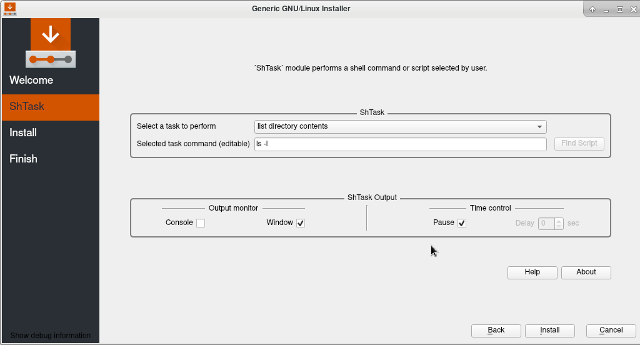
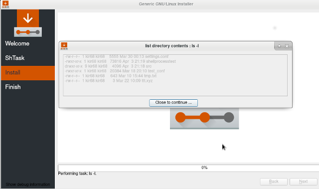

# Module shtask 
[shtask](https://github.com/essine/shtask) (shell task) module is a [Calamares](https://github.com/calamares) module 
that allows to perform a shell command or script selected by user. 
***
+ [About](#about)
	- [*Module interface*](#module-interface)
	- [*Module output*](#module-output)
+ [Installation](#installation)
+ [Usage](#usage)
+ [Configuration](#configuration)
+ [Test module](#test-module)
+ [Customize interface](#customize-interface)
+ [Script](#script)
+ [Slideshow](#slideshow)

## About
Module [shtask](https://github.com/essine/shtask) (shell task) is a [Calamares](https://github.com/calamares) module.
Calamares is a distribution-independent installer framework which 
has several modules. 
'shtask' module is a simple Qt C++ GUI application, that allows 
to perform a shell command or script selected by user.
Shell command list can be edit in the module configuration file _shtask.conf_.
'shtask' module interface looks as shown in 'Module interface' figure. 
The interface is almost fully customizable by editing _shtask.conf_.
Thus, for example, the 'moduleLabel' parameter in _shtask.conf_ defines 
the user-visible module name, which is 'ShTask' by default. 
The whole 'ShTask Output' groupbox can be hidden by setting 
'taskOutputBox' to false. 'Help' and 'About' texts are also editable.
All the interface customization parameters are listed in [Customize interface](#customize-interface) section.

#### _Module interface._
Module interface supports shell command selection and, if necessary, correction.
The shell command output can be directed to console or a graphical window 
(see [Usage](#usage) section).     

#### _Module output._
Here the shell command output is directed to a graphical window.
The output is diplayed and module wait for 'Close to continue...' button press.
It can be useful to debug the module.

## Installation
If _.../calamares/src/modules/shtask_ directory does not exist after loading the [Calamares](https://github.com/calamares), 
please create the directory and copy in it _shtask_ module-related files and folders. 

The following installation step is optional and can be skipped.
There is a directory named _branding_ in _shtask_ module directory.
It contains files that can be placed in Calamares branding directory usually located
at _.../calamares/src/branding/default/_ before Calamares installation and 
at _/usr/share/calamares/branding/default/_ after Calamares installation. 
These files, excluding _shtask.sh_, are responsible for a [slideshow](#slideshow) 
displayed during execution steps. Script _shtask.sh_ is an example that 
can be modified. It is placed here to facilitate its finding.

## Usage
If _shtask_ module is properly listed in the Calamares configuration file 
_settings.conf_ (see [Test module](#test-module) section), it will prompt 
user to select a task from the combobox list. 
Select a shell command using 'Select a task to perform' combobox (see 
'Module interface' figure). The selected command can be corrected in 
'Selected task command' line edit. ''ShTask' Output' groupbox allows 
to direct shell command output to console or a graphical window.  
Output window closing delay and pause are also under control of 
''ShTask' Output' groupbox items. Task name list 'taskLabels' 
and command list 'taskCommands', as well as other parameters, are defined 
in _shtask.conf_ [configuration](#configuration) file.
Shell command may also contain the name of the [script](#script) to execute.

## Configuration
Module _shtask_ reads _shtask.conf_, the module configuration file.
File _shtask.conf_ contains parameters that control _shtask_ module.
'taskLabels' and 'taskCommands' parameters define task selection list.   
Some of the parameters like 'moduleLabel' and 'moduleInfoLine' 
allow to [customize](#customize-interface) module interface. 
If a parameter value is a string with special characters use quotes 
(YAML rules).
  
The following parametes are available in shtask.conf:
	
* #### _moduleLabel_
	String will appear in the Calamares module name list.  
	The parameter is created to customize module interface.  
	>`moduleLabel: ShTask`
* #### _moduleInfoLine_
	String will appear at the top of the task selection page.  
	The parameter is created to customize module interface.  
	>`moduleInfoLine: "´ShTask´ module performs a shell command or script selected by user."`
* #### _taskChoiceLabel_
	String will appear to the left of the task selection combobox.  
	The parameter is created to customize module interface.
	>`taskChoiceLabel: Select a task to perform`		
* #### _taskEditLabel_
	String will appear to the left of the command line edit.  
	The parameter is created to customize module interface.  
	>`taskEditLabel: Selected task command (editable)`
* #### _taskOutputBox_
	If 'taskOutputBox' is true,  
	the groupbox that contains 'Output monitor' and 'Time control' elements  
	will be shown. The parameter is created to customize module interface.
	>`taskOutputBox: true`
* #### _taskLabels_ 
	String list for the task selection combobox.  
	The parameter is created to customize module interface.
    >`taskLabels:`    
	>&nbsp; &nbsp; &nbsp; &nbsp; `- current directory`      
	>&nbsp; &nbsp; &nbsp; &nbsp; `- list directory contents`      
	>&nbsp; &nbsp; &nbsp; &nbsp; `- "shell script shtask.sh"`       
* #### _taskCommands_
	String list of commands correspond to the labels in 'taskLabels' list.  
	For a bash script please indicate the correct script path.  
	If script file path is not indicated, module looks for the script   
	in current directory or in Calamares branding directory (see [Script](#script) section).  
    >`taskCommands:`  
    >&nbsp; &nbsp; &nbsp; &nbsp; `- pwd`  
    >&nbsp; &nbsp; &nbsp; &nbsp; `- ls -l`  
    >&nbsp; &nbsp; &nbsp; &nbsp; `- "bash anytask.sh"`
* #### _taskScript_	
	If 'taskScript' string list is present,  
	module creates generated.sh script from the list.  
	A corresponding task appears in 'taskLabels' and  
	'taskCommands' lists under the name 'generated script'.  
	File _generated.sh_ is temporary file and will be deleted (see [Script](#script) section).	
	>`taskScript:`  
    >&nbsp; &nbsp; &nbsp; &nbsp; `- pwd`  
    >&nbsp; &nbsp; &nbsp; &nbsp; `- uname-a`
* #### _taskOutputConsole_
	If 'taskOutputConsole' is true,  
	the command output appears in Calamares console ( "calamares -d" ).  
	The parameter is created to debug the module.
	>`taskOutputConsole: false`
* #### _taskOutputWindow_
	If 'taskOutputWindow' is true,  
	the command output appears in a graphical window.  
	The parameter is created to debug the module.
	>`taskOutputWindow: false`	
* #### _outputPause_
	If 'outputPause' is true,  
	the command output widnow will pause and wait for a button to be pressed.  
	The parameter is created to debug the module.
	>`outputPause: false`	
* #### _outputDelaySec_
	If interger is > 0,  
	the command output widnow sleeps for 'outputDelaySec' seconds.  
	The parameter is created to debug the module.
	>`outputDelaySec: 0`	
* #### _taskHelp_
	If 'taskHelp' string list is present,   
	pressing 'Help' button displays the text created from the list.
	>`taskHelp:`  
	>&nbsp; &nbsp; &nbsp; &nbsp; `- "Select a shell command or script using 'Select a task to perform' combobox."`  
	>&nbsp; &nbsp; &nbsp; &nbsp; `- "The selected command can be corrected in 'Selected task command' line edit."`  
	>&nbsp; &nbsp; &nbsp; &nbsp; `- "Check 'Console' checkbox to send command output to Calamares console (calamares -d)."`  
	>&nbsp; &nbsp; &nbsp; &nbsp; `- "Check 'Window' checkbox to send command output to a new graphical window."`  
	>&nbsp; &nbsp; &nbsp; &nbsp; `- "If checkbox 'Pause' is checked, the output window stay visible until close button click."`  
	>&nbsp; &nbsp; &nbsp; &nbsp; `- "If 'Pause' is unchecked, the output window will be shown for selected 'Delay' seconds."`  
	>&nbsp; &nbsp; &nbsp; &nbsp; `- "The parameters that control module behavior are defined in 'shtask.conf' configuration file."`  
	>&nbsp; &nbsp; &nbsp; &nbsp; `- "For more help please see README.html."`  
	>&nbsp; &nbsp; &nbsp; &nbsp; `- "\n"`  
	>&nbsp; &nbsp; &nbsp; &nbsp; `- "This text can be replaced in shtask.conf, the module configuration file."`
* #### _taskAbout_
	If 'taskAbout' string list is present, 
	pressing 'About' button displays the text created from the list.
	>`taskAbout:`  
	>&nbsp; &nbsp; &nbsp; &nbsp; `- "'shtask' is a Calamares module."`  
	>&nbsp; &nbsp; &nbsp; &nbsp; `- "It allows to select and perform a shell command or script."`  
	>&nbsp; &nbsp; &nbsp; &nbsp; `- "\n"`  
	>&nbsp; &nbsp; &nbsp; &nbsp; `- "This text can be replaced in shtask.conf, the module configuration file."`
## Test module
The configuration of Calamares is done in _settings.conf_.
The modules listed in _settings.conf_ are loaded one by one.  
To test 'shtask' alone comment all the modules in settings.conf 
except of 'welcome' and 'finished' modules:

>`sequence:`
>`- show:`  
>&nbsp; &nbsp; `- welcome`  
>&nbsp; &nbsp; `- shtask`  
>`- exec:`  
>&nbsp; &nbsp; `- shtask`  
>`- show:`  
>&nbsp; &nbsp; `- finished`  
>`branding: default`

set 'taskOutputBox' parameter in _shtask.conf_ to true.
It allows to monitor 'shtask' output. 
The output can be directed to Calamares console, 
if Calamares was started with debug option 'calamares -d', 
or to a graphical window. Please see for details the description of 
'taskOutputConsole', 'taskOutputWindow', 'outputPause' and 
'outputDelaySec' parameters in [Configuration](#configuration) section. 

## Customize interface
Module interface can be customized using following parameters from _shtask.conf_:
'moduleLabel', 'moduleInfoLine', 'taskChoiceLabel', 'taskEditLabel', 
'taskOutputBox', 'taskHelp' and 'taskAbout'.
Please see [Configuration](#configuration) section for details. 

## Script
Shell command may contain the name of the script to execute e.g.: 'bash shtask.sh'. 
If script file path is not indicated, module looks for the script in 
current directory or in Calamares branding directory, which is usually 
_/usr/share/calamares/branding/default"_. Script file can be placed in 
Calamares branding directory to facilitate search (see [Installation](#installation) section).
For manual search please use 'Find Script' button.
If 'taskScript' string list is present in _shtask.conf_, module creates 
in current directory _generated.sh_ script from the list. A corresponding task appears 
in 'taskLabels' and 'taskCommands' lists under the name 'generated script'. 
File _generated.sh_ is temporary file and will be deleted.  

## Slideshow
A slideshow is displayed during execution steps (e.g. when the
installer is actually writing to disk and doing other slow things).
To customize slideshow edit file *.../branding/default/show.qml*
or replace it with *show.qml* provided by shtask module 
*.../calamares/src/shtask/branding/show.qml* and copy corresponding **.png* files.   
Please keep in mind that QML slideshow is common for all modules.
		
[Scroll Up](#module-shtask)

